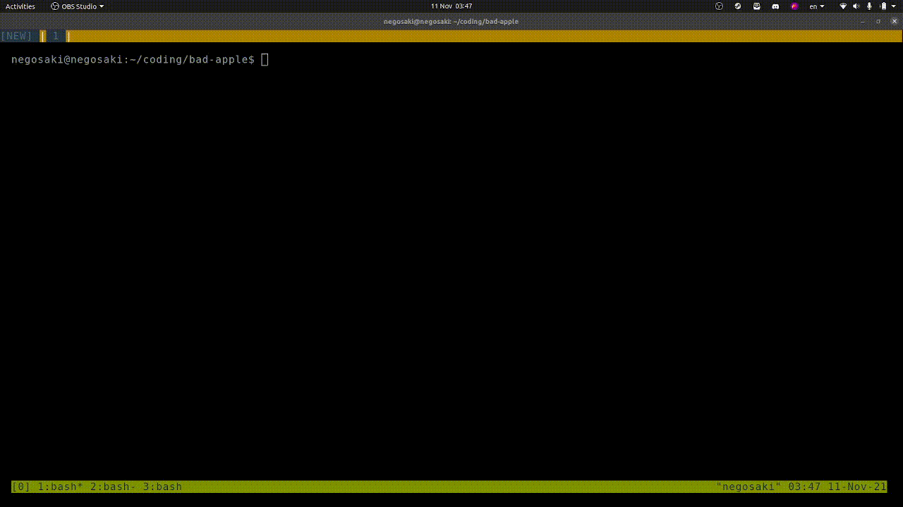

# bad-apple-python
Bad apple in the (unix) terminal using Python. Original youtube video:
[https://www.youtube.com/watch?v=FtutLA63Cp8](https://www.youtube.com/watch?v=FtutLA63Cp8)

## Running the program
1. Make sure you have all the necessary dependencies installed:
    * `python3` packages:
        * `numpy`
        * `pillow`
    * `imagemagick`
    * `ffmpeg`
    * `youtube-dl`
2. Clone the repository: `git clone https://github.com/christofferaakre/bad-apple-python.git`
3. `cd bad-apple-python`
4. Run the setup script: `./setup`
5. Run the python script: `python3 bad-apple.py`
